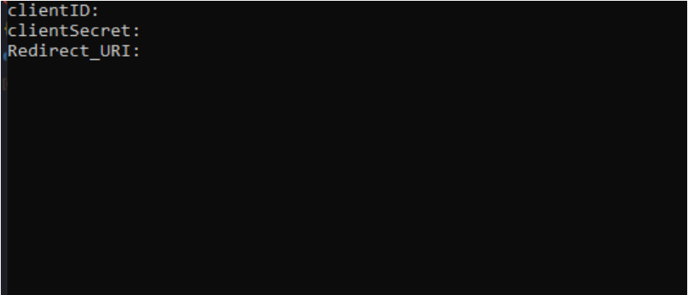
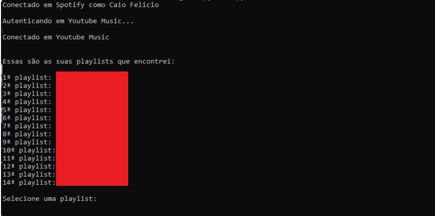

# Transfira playlists do Spotify para Youtube Music

Este programa foi feito com o intuito de automatizar o processo de transferência de playlists entre o [Spotify](https://www.spotify.com/br/) e o [Youtube Music](https://music.youtube.com/).

## Como usar:

Será necessário ter o [python](https://www.python.org/downloads/) instalado em sua máquina.

Após isso, é necessário instalar as dependências dessa aplicação:

* [spotipy](https://spotipy.readthedocs.io/en/2.17.1/)
* [ytmusicapi](https://ytmusicapi.readthedocs.io/en/latest/usage.html)
* [python-dotenv](https://pypi.org/project/python-dotenv/)

Para **cada** uma das dependências acima, execute no terminal os seguintes comandos:

***`pip install spotipy`***

***`pip install ytmusicapi`***

***`pip install python-dotenv`***

## Autenticação no *Spotify*:

Para se conectar no Spotify, será necessário criar um app em <https://developer.spotify.com/dashboard/> para ter acesso as suas credenciais necessárias para a autenticação na [API do Spotify](https://developer.spotify.com/documentation/web-api/).

Para ver o passo-a-passo de como criar o app e pegar as credenciais <a href="https://helphere.github.io/" target="_blank">clique aqui</a>.

***NÃO COMPARTILHE SUAS CREDENCIAIS COM NINGUÉM***

## Autenticação *Youtube Music*:

A autenticação no Youtube Music é um pouco mais complexa. Você precisará dos cookies da sua sessão para se autenticar. No arquivo ***`headers_auth.json`*** existe uma chave chamada ***`Cookie`*** e o valor dela é o cookie da sua sessão.

Nesse [link](https://ytmusicapi.readthedocs.io/en/latest/setup.html) você encontrará um guia de como pegar os cookies da sua sessão.

Os cookies, **só valem enquanto você tiver uma sessão logada no Youtube Music**, caso seja feito logout, você deverá repetir o processo anterior.

## Rodando o código:

Para executar o programa. Abra o terminal na pasta que contém o projeto e digite _**`py main.py`**_ ou _**`python main.py`**_.

Ao executar o programa pela primeira vez, será mostrada a seguinte tela.

 Nos campos **`clientID`**, **`clientSecret`** e **`Redirect_URI`** coloque suas credenciais.

Se suas credenciais estiverem certas, e os cookies da sua sessão forém válidos, você verá a seguinte imagem:

 Selecione o numero da playlist que desejar para começar a transferir. O processo pode levar alguns segundos.

